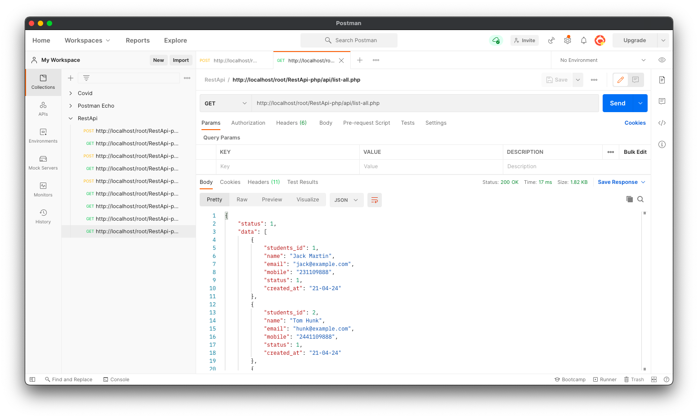
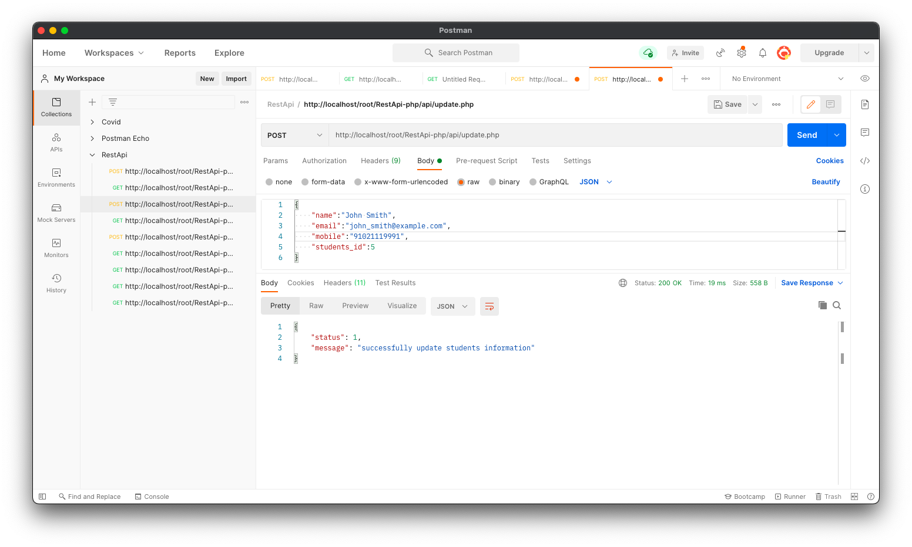
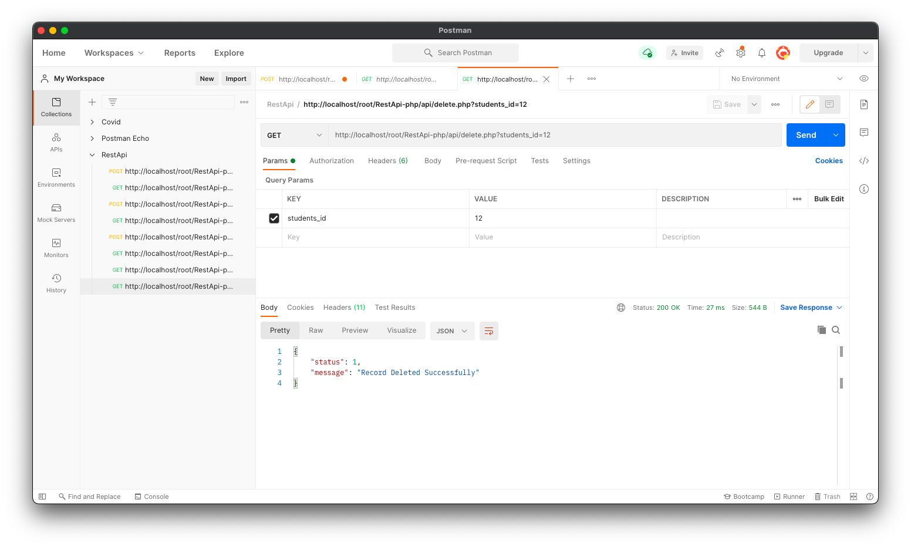
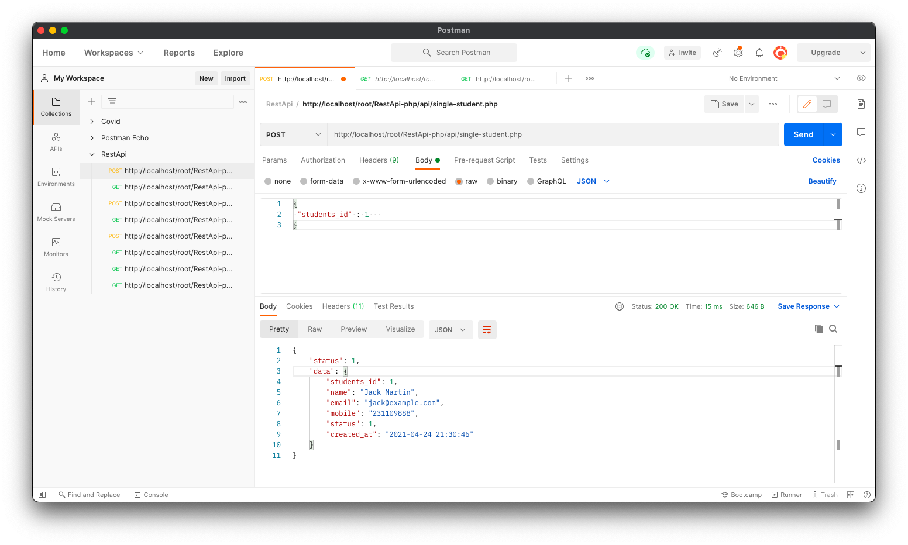
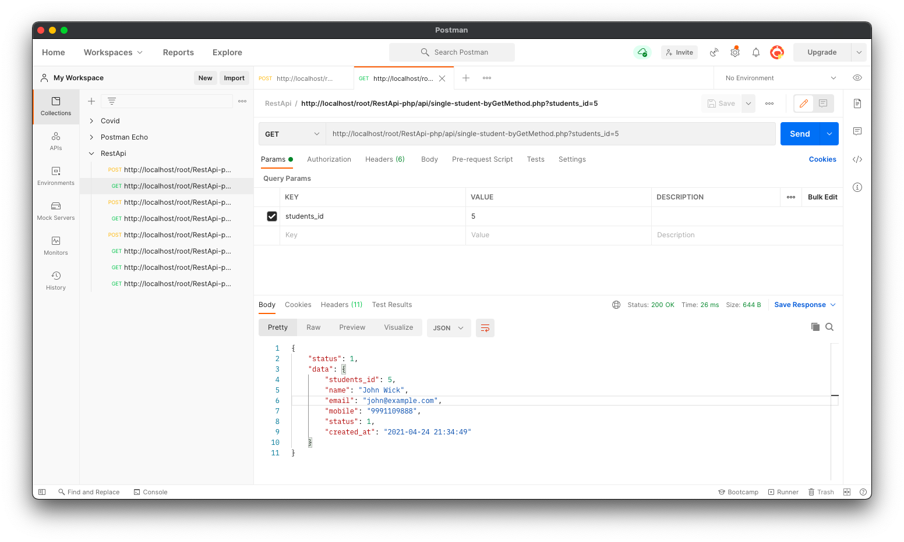
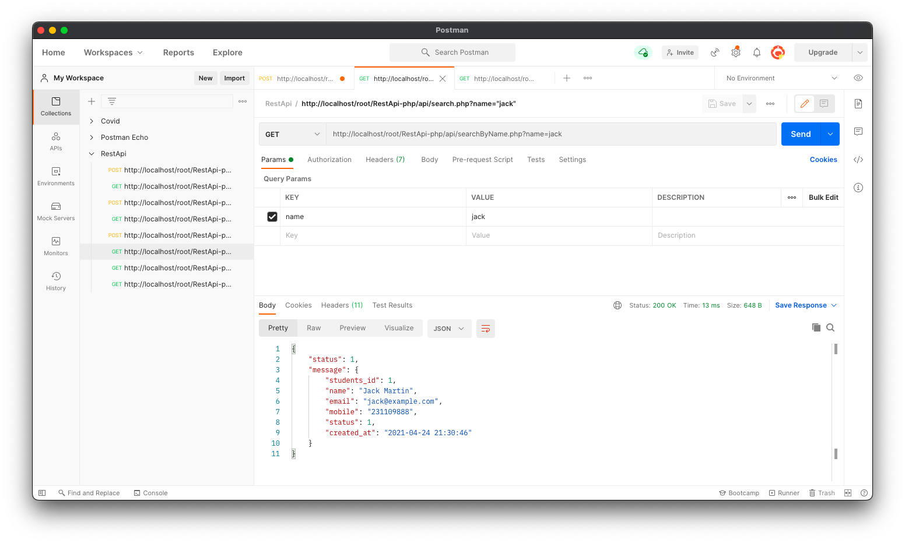

# Rest-Api-Php

### 1. List All Students

### 2. Create Record

### 3. Update Record

### 4. Delete Record

### 5. Fetch Single Record

### 6. Fetch Single Record Using GET

### 7. Search Student By Name

